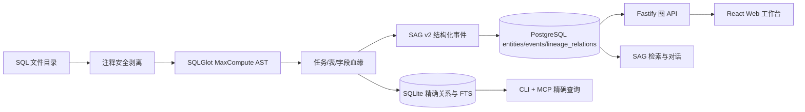

# SQL CodeGraph 架构评估

## 结论

当前 `snw-sag-sql-lineage + snw-sag` 与 GitNexus、codegraph 在宏观链路上相似：都包含确定性解析、结构化图存储、图遍历、检索、MCP 和 Web/API 出口。但当前实现仍是“SQL 血缘索引器 + SAG 关系投影”，还不是完整的代码图平台。

不应推翻现有 SQLGlot 血缘内核，也不应把 SAG 变成事实源。正确路线是：

1. 将 `snw-sag-sql-lineage` 演进为本地优先、可增量同步的 SQL CodeGraph 索引内核。
2. 保持 SQLite 精确图为权威事实源，SAG 只承载结构化投影、证据召回和对话能力。
3. 在 `snw-sag` 中提供 GitNexus 风格工作台，并针对 SQL 使用分层 DAG，而不是照搬通用代码的力导向概览。

本文借鉴 GitNexus 与 codegraph 的索引生命周期、图查询和交互架构，不将 SQL 描述为两者的官方支持语言，也不以 Tree-sitter 替换当前 SQLGlot 解析内核。

## 开源方案的核心

以下能力基线依据 2026-07-15 对官方仓库的复核结果。

### GitNexus

GitNexus 当前使用 15 阶段 DAG 编排目录发现、Tree-sitter AST 抽取、跨文件解析、图增强和索引生成。图写入嵌入式 LadybugDB，同一后端服务 CLI、MCP 和 HTTP；Web 是 React 薄客户端，并使用 Sigma.js/Graphology 展示通用代码图。

它使用倒数排名融合（Reciprocal Rank Fusion，RRF）组合多路检索结果，并在同一张图上提供 `impact`、`trace`、程序依赖图（Program Dependence Graph，PDG）和多仓库注册。其关键价值不是某个单独算法，而是 CLI、MCP、HTTP、Git 变更映射、混合检索和 Web 检查器共享同一套索引语义。

### codegraph

codegraph 采用更轻的本地架构：Tree-sitter 抽取符号与边，SQLite/FTS5 持久化，解析器补充跨文件引用和框架关系。它通过 `sync`、`watch` 和 Git hook 按文件维护索引，提供 `callers`、`callees`、`impact` 与 MCP 出口。

旧的宽泛 `context` 工具已不再是当前工具面；源码定位改由 `explore`、`node` 等更精确的工具承担。本文后续接口设计也应优先采用职责单一、可验证的节点与遍历工具。

开源版重点是 CLI/MCP 代码智能，没有与 GitNexus 同级的 Web 图谱工作台。

## 当前实现



### 已经具备

| 能力 | 当前实现 | 判断 |
| --- | --- | --- |
| 确定性解析 | SQLGlot + MaxCompute 方言 | 可保留，是 SQL 领域优势 |
| 领域图模型 | task/table/column 与类型化关系 | 已覆盖核心血缘语义 |
| 证据定位 | 文件路径、语句序号、行号、表达式、证据 SQL、置信度 | 基础完整 |
| 本地图存储 | SQLite 关系表与 FTS5 | 当前规模足够 |
| 精确遍历 | 表/字段多层上下游 BFS | 已具备 |
| Agent 出口 | CLI、9 个 MCP Tools、Skill | 已具备 |
| RAG 投影 | SAG v2 严格信封与 PostgreSQL 关系表 | 已具备 |
| Web 出口 | 懒加载图 API、搜索、穿透、详情 | 已具备基础 |

### 关键差距

| 代码图平台能力 | 当前状态 | 影响 |
| --- | --- | --- |
| 索引生命周期 | `rebuild()` 全表清空后重建 | 大目录每次重复解析，删除/修改不能按文件收敛 |
| 文件图模型 | 文件仅是属性，不是一等节点 | 无法从目录/文件导航到语句和血缘 |
| 细粒度 AST 节点 | 没有 statement/CTE/expression/function 节点 | 源码检查器与表达式影响分析能力不足 |
| 稳定源码范围 | 关系有行号，但缺少统一 start/end span 与片段接口 | Web 无法像 GitNexus 一样同步定位源码 |
| 版本与新鲜度 | 无 Git commit、分支、解析器版本和 stale 状态 | 无法判断索引是否对应当前代码 |
| 自动同步 | 无文件监听或 Git hook 增量同步 | 索引容易过期 |
| 通用路径/影响 | 只有按实体类型选择表的 BFS | 缺少 relation filter、shortest path、blast radius 和变更影响 |
| 混合检索 | 本地只有事件 FTS；语义召回依赖 SAG | 精确符号、结构路径、全文与向量没有统一排序 |
| 多项目注册 | SQLite 路径靠配置传入 | 缺少仓库注册、状态和快速切换 |
| Web 源码联动 | 只有实体/事件详情 | 缺少文件树、SQL 检查器和关系证据同步高亮 |
| 答案安全投影 | SAG 已接收类型化关系，但没有约束回答必须回到同一组确定性证据 | 语义召回可能把不同语句的候选拼进同一答案图 |
| 答案图隔离 | 尚无阻止跨 Statement、跨证据集合连边的装配规则 | 同名实体或语义相似不能证明路径属于同一答案 |

## 目标架构

### 1. 索引内核

索引管线拆成显式阶段，并让每个阶段有可缓存输出：

```text
discover -> fingerprint -> clean -> parse -> resolve -> graph -> search-index -> publish
```

- `discover`：遵守 `.gitignore` 与项目排除规则，登记 SQL 文件。
- `fingerprint`：保存相对路径、内容哈希、Git commit、方言和解析器版本。
- `clean`：安全删除注释，同时保留行列映射。
- `parse`：SQLGlot 生成语句、CTE、表、字段、表达式和函数引用。
- `resolve`：跨文件解析生产表、消费表、CTE、字段来源与同名歧义。
- `graph`：按文件事务 upsert 节点和边；删除文件时只撤销该文件贡献的证据。
- `search-index`：建立标识符 FTS、证据全文索引和可选向量索引。
- `publish`：按需向 SAG 发布版本化、只读的完整 v3 evidence 投影，保留临时节点、原始边和显式实体语义；SAG 不能反向修改精确图。

本轮由 SQLGlot 事实源统一判断表名任一规范化段是否包含 `tmp` 或 `temp`（不区分大小写）。命中的表及其字段在精确图内分别标记为 `TableLifecycle=temporary`、`NodeVisibility=evidence_only`，对外 v3 角色映射为 `semantics.role=temporary`。它们与原始关系仍完整进入精确图和 evidence 投影，但不得成为答案实体、答案关系端点或自然语言结论中的表名。

查询时再从完整 evidence graph 计算只读 answer projection：默认响应只返回业务端点和不含隐藏名称的 `evidencePathSummaries`，完整临时链必须通过显式证据详情查看，收缩结果不得写回 SQLite 或 SAG。完整 v3 evidence 发布和显式详情必须携带仓库、文件、语句、源码范围、内容指纹和 evidence 标识；默认 answer summary 不内联这些完整锚点。SAG 在单个已摄取 graph revision 内做本地确定性校验，不实时回调 SQLite，结论只承诺与该 v3 evidence 快照一致；当前源目录的新鲜度和权威 raw 查询由 SQL lineage 的 `status`/raw 工具负责。仅因同名、语义相似或跨语句扩展得到的候选，不得合并为一条答案路径。

### 2. 统一 SQL 图模型

本轮增加一等节点，并保留已有领域节点：

```text
Repository, File, Statement, Task, Table, Column
```

下一阶段再扩展语法细节节点：

```text
CTE, Expression, Function
```

建议统一关系：

```text
CONTAINS, DEFINES, READS, WRITES, PRODUCES,
DATA_FLOW, HAS_COLUMN, SOURCE_FOR_COLUMN,
DIRECT_FROM, DERIVED_FROM, AGGREGATED_FROM,
CONDITIONAL_FROM, WINDOWED_FROM,
LEFT_JOIN, RIGHT_JOIN, FULL_OUTER_JOIN, INNER_JOIN, CROSS_JOIN,
FILTERS_BY, GROUPS_BY, CALLS
```

每个节点和关系必须携带稳定 ID、来源文件、源码范围、方言、内容哈希、置信度和证据。多个文件或语句支持同一关系时，应保存多条 evidence，而不是覆盖成一条边。

### 3. 存储选择

第一阶段继续使用 SQLite。SQL 血缘主要是有方向的稀疏 DAG，现有规模下索引表、递归 CTE、FTS5 和事务 upsert 足以支撑；立即引入第二套图数据库会增加部署、迁移和一致性成本。

当出现以下硬需求时再评估 LadybugDB：

- 需要向用户开放通用 Cypher；
- 单项目达到百万级节点且多关系路径查询成为瓶颈；
- 社区发现、复杂子图匹配成为核心交互；
- 基准证明 SQLite 无法满足延迟目标。

### 4. 查询与 MCP

SQL CodeGraph 应统一提供：

```text
search_symbols, explore, node, upstream, downstream,
trace, impact, changed_impact, open_source,
index, sync, status
```

`explore` 负责有限范围发现，`node` 返回单节点及精确证据；不再设置职责宽泛的 `context` 核心工具。检索顺序应优先精确标识符，再组合 FTS、结构邻域与可选向量结果。自然语言只负责找候选；最终血缘结论必须回到确定性路径和源码证据。

### 5. Web 工作台

当前 React Flow + ELK 工作台已采用适合 SQL 血缘的信息架构，不复制 GitNexus 的通用代码画布算法：

- 左侧：项目/文件浏览、节点与关系筛选、穿透层级。
- 中央：白底二维血缘画布；表级和字段级使用 ELK 分层 DAG，项目总览可后续增加 Sigma.js 模式。
- 右侧：实体、关系、来源 SQL、行号、表达式、置信度和上下游摘要。
- 顶部：全局搜索、索引状态、复位、适配视图和视图模式。

首屏只加载任务和业务表骨架；选中或搜索后按层级加载字段。字段必须收进所属表卡片，JOIN 关系直接显示 SQL 类型。临时表只在 evidence graph 和显式证据详情中完整保留，默认 answer 画布用匿名证据胶囊表示被收缩链路。

## 本轮交付范围与工程顺序

React Flow + ELK 三段式工作台已作为现有基线，不再列入待实施阶段。

跨仓工程依赖顺序固定为：先在 `snw-sag-sql-lineage` 完成分类、Repository/File/Statement、增量同步、answer projection 与 v3 输出；再在 `snw-sag` 完成 v3 摄取、双图投影、答案校验与 MCP；最后落地工作台折叠、端口路由、几何审计和浏览器验收。

### 本轮：答案安全与索引生命周期闭环

1. **answer-safe 临时表证据边界**：先把包含 `tmp/temp` 中间节点、原始边、确定性路径、方向、源码范围和 evidence 标识的完整 v3 evidence 发布到 SAG；SAG 在同一 graph revision 内计算隐藏临时端点的 answer projection，且不得把收缩伪边发布回 SAG evidence graph 或 SQLite。需要当前源码级权威判断时显式调用 SQL lineage 工具。
2. **Repository/File/Statement**：建立一等节点、稳定 ID、统一源码范围和文件到语句的包含关系，为后续源码检查器提供锚点。
3. **增量同步与 Git freshness**：按文件内容哈希事务化 upsert/delete，记录 commit、分支、方言和 parser 版本，提供 `index`、`sync`、`status` 与 stale 判断。
4. **无歧义答案图**：回答图只能包含由同一确定性证据集合闭合支持的路径；`tmp/temp` 路径在主画布收缩为证据胶囊，完整跳点只在检查器展开。ELK 使用真实端口和边段，布局后检测节点重叠、边穿节点和非端点交叉；无法平面化的次要关系收进证据束或检查器，不在主画布绘制交叉线。

### 下一阶段：细粒度代码智能

1. **Expression/CTE/Function**：补齐细粒度节点、解析关系和稳定源码范围。
2. **源码与影响分析**：提供 `open_source`、`impact`、`changed_impact`，让 Git 变更映射到可验证的 SQL 影响路径。
3. **统一混合检索**：融合精确标识符、FTS、结构邻域和可选向量候选，可参考 RRF，但最终排序结果必须保留确定性路径与源码证据。
4. **自动触发同步**：在增量 `sync` 稳定后再接入 `watch` 或 Git hook，避免把触发机制和索引事务语义耦合在同一轮。

## 验收原则

- 精确血缘的召回与方向不能因 UI 或 SAG 语义检索而改变。
- 每条答案路径都能通过 v3 evidence 锚点追溯到 SQLite 中包含完整临时表跳点的闭合 evidence 集合；这表示可审计映射，不要求 SAG 运行时实时回调 SQLite。
- 答案实体、答案关系端点和自然语言结论不得包含被标记为 `temporary/evidence_only` 的表或字段名。
- 不同 Statement 或不同证据集合的候选不得在答案图中交叉拼接。
- 同一未变化目录重复同步时，解析文件数应接近零。
- 修改或删除单个 SQL 时，只更新该文件贡献的节点、关系和证据。
- `status` 必须区分当前、过期和不可判定状态，并说明对应的 Git commit、分支及 parser 版本。
- Web 选中实体后，图、检查器和源码范围使用同一稳定 ID 联动。
- 默认答案画布的节点重叠、边穿节点和非端点交叉计数均为零；完整非平面证据通过检查器访问而不是强行画成交叉线。
- 大图首屏、搜索、单节点展开和多层穿透均有明确数量与延迟上限。

## 参考实现

- [abhigyanpatwari/GitNexus](https://github.com/abhigyanpatwari/GitNexus)
- [GitNexus Architecture](https://github.com/abhigyanpatwari/GitNexus/blob/main/ARCHITECTURE.md)
- [colbymchenry/codegraph](https://github.com/colbymchenry/codegraph)
- [codegraph architecture notes](https://github.com/colbymchenry/codegraph/blob/main/CLAUDE.md)
