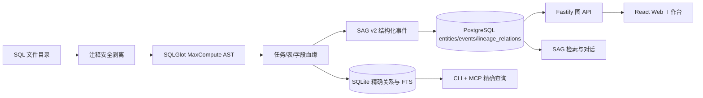

# SQL CodeGraph 架构评估

## 结论

当前 `snw-sag-sql-lineage + snw-sag` 与 GitNexus、codegraph 在宏观链路上相似：都包含确定性解析、结构化图存储、图遍历、检索、MCP 和 Web/API 出口。但当前实现仍是“SQL 血缘索引器 + SAG 关系投影”，还不是完整的代码图平台。

不应推翻现有 SQLGlot 血缘内核，也不应把 SAG 变成事实源。正确路线是：

1. 将 `snw-sag-sql-lineage` 演进为本地优先、可增量同步的 SQL CodeGraph 索引内核。
2. 保持 SQLite 精确图为权威事实源，SAG 只承载结构化投影、证据召回和对话能力。
3. 在 `snw-sag` 中提供 GitNexus 风格工作台，并针对 SQL 使用分层 DAG，而不是照搬通用代码的力导向概览。

## 开源方案的核心

### GitNexus

GitNexus 使用多阶段管线完成目录扫描、Tree-sitter AST 抽取、跨文件解析、社区聚类、执行过程识别和混合检索。图写入嵌入式 LadybugDB，同一后端同时服务 CLI、MCP 和 HTTP；Web 是 React 薄客户端，并使用 Sigma.js/Graphology 展示通用代码图。

它的关键价值是完整的代码智能闭环：源码范围、符号、关系、调用上下文、路径、影响分析、Git 变更映射、混合检索和 Web 检查器使用同一张图。

### codegraph

codegraph 采用更轻的本地架构：Tree-sitter 抽取符号与边，SQLite/FTS5 持久化，解析器补充跨文件引用和框架关系，图遍历器提供 callers、callees、path 和 impact。原生文件监听器会按文件增量同步索引，MCP 直接返回精确源码上下文。

开源版重点是 CLI/MCP 代码智能，没有与 GitNexus 同级的 Web 图谱工作台。

## 当前实现



### 已经具备

| 能力 | 当前实现 | 判断 |
| --- | --- | --- |
| 确定性解析 | SQLGlot + MaxCompute 方言 | 可保留，是 SQL 领域优势 |
| 领域图模型 | task/table/column 与类型化关系 | 已覆盖核心血缘语义 |
| 证据定位 | 文件路径、语句序号、行号、表达式、证据 SQL、置信度 | 基础完整 |
| 本地图存储 | SQLite 关系表与 FTS5 | 当前规模足够 |
| 精确遍历 | 表/字段多层上下游 BFS | 已具备 |
| Agent 出口 | CLI、9 个 MCP Tools、Skill | 已具备 |
| RAG 投影 | SAG v2 严格信封与 PostgreSQL 关系表 | 已具备 |
| Web 出口 | 懒加载图 API、搜索、穿透、详情 | 已具备基础 |

### 关键差距

| 代码图平台能力 | 当前状态 | 影响 |
| --- | --- | --- |
| 索引生命周期 | `rebuild()` 全表清空后重建 | 大目录每次重复解析，删除/修改不能按文件收敛 |
| 文件图模型 | 文件仅是属性，不是一等节点 | 无法从目录/文件导航到语句和血缘 |
| 细粒度 AST 节点 | 没有 statement/CTE/expression/function 节点 | 源码检查器与表达式影响分析能力不足 |
| 稳定源码范围 | 关系有行号，但缺少统一 start/end span 与片段接口 | Web 无法像 GitNexus 一样同步定位源码 |
| 版本与新鲜度 | 无 Git commit、分支、解析器版本和 stale 状态 | 无法判断索引是否对应当前代码 |
| 自动同步 | 无文件监听或 Git hook 增量同步 | 索引容易过期 |
| 通用路径/影响 | 只有按实体类型选择表的 BFS | 缺少 relation filter、shortest path、blast radius 和变更影响 |
| 混合检索 | 本地只有事件 FTS；语义召回依赖 SAG | 精确符号、结构路径、全文与向量没有统一排序 |
| 多项目注册 | SQLite 路径靠配置传入 | 缺少仓库注册、状态和快速切换 |
| Web 源码联动 | 只有实体/事件详情 | 缺少文件树、SQL 检查器和关系证据同步高亮 |

## 目标架构

### 1. 索引内核

索引管线拆成显式阶段，并让每个阶段有可缓存输出：

```text
discover -> fingerprint -> clean -> parse -> resolve -> graph -> search-index -> publish
```

- `discover`：遵守 `.gitignore` 与项目排除规则，登记 SQL 文件。
- `fingerprint`：保存相对路径、内容哈希、Git commit、方言和解析器版本。
- `clean`：安全删除注释，同时保留行列映射。
- `parse`：SQLGlot 生成语句、CTE、表、字段、表达式和函数引用。
- `resolve`：跨文件解析生产表、消费表、CTE、字段来源与同名歧义。
- `graph`：按文件事务 upsert 节点和边；删除文件时只撤销该文件贡献的证据。
- `search-index`：建立标识符 FTS、证据全文索引和可选向量索引。
- `publish`：按需向 SAG 发布版本化关系投影，不能反向修改精确图。

### 2. 统一 SQL 图模型

建议增加一等节点：

```text
Repository, Directory, File, Task, Statement, CTE,
Table, Column, Expression, Function, Parameter
```

建议统一关系：

```text
CONTAINS, DEFINES, READS, WRITES, PRODUCES,
DATA_FLOW, HAS_COLUMN, SOURCE_FOR_COLUMN,
DIRECT_FROM, DERIVED_FROM, AGGREGATED_FROM,
CONDITIONAL_FROM, WINDOWED_FROM,
LEFT_JOIN, RIGHT_JOIN, FULL_OUTER_JOIN, INNER_JOIN, CROSS_JOIN,
FILTERS_BY, GROUPS_BY, CALLS
```

每个节点和关系必须携带稳定 ID、来源文件、源码范围、方言、内容哈希、置信度和证据。多个文件或语句支持同一关系时，应保存多条 evidence，而不是覆盖成一条边。

### 3. 存储选择

第一阶段继续使用 SQLite。SQL 血缘主要是有方向的稀疏 DAG，现有规模下索引表、递归 CTE、FTS5 和事务 upsert 足以支撑；立即引入第二套图数据库会增加部署、迁移和一致性成本。

当出现以下硬需求时再评估 LadybugDB：

- 需要向用户开放通用 Cypher；
- 单项目达到百万级节点且多关系路径查询成为瓶颈；
- 社区发现、复杂子图匹配成为核心交互；
- 基准证明 SQLite 无法满足延迟目标。

### 4. 查询与 MCP

SQL CodeGraph 应统一提供：

```text
search_symbols, context, upstream, downstream,
trace, impact, changed_impact, open_source,
index, sync, status
```

检索顺序应优先精确标识符，再组合 FTS、结构邻域与可选向量结果。自然语言只负责找候选；最终血缘结论必须回到确定性路径和源码证据。

### 5. Web 工作台

Web 借鉴 GitNexus 的信息架构，而不是复制其画布算法：

- 左侧：项目/文件浏览、节点与关系筛选、穿透层级。
- 中央：白底二维血缘画布；表级和字段级使用 ELK 分层 DAG，项目总览可后续增加 Sigma.js 模式。
- 右侧：实体、关系、来源 SQL、行号、表达式、置信度和上下游摘要。
- 顶部：全局搜索、索引状态、复位、适配视图和视图模式。

首屏只加载任务和表骨架；选中或搜索后按层级加载字段。字段必须收进所属表卡片，JOIN 关系直接显示 SQL 类型，临时表与普通表一致保留。

## 实施顺序

1. **Web 可读性**：用 React Flow + ELK 替换 3D 血缘图，完成三段式工作台。
2. **索引元数据**：增加 repository/file/statement 节点、源码范围、Git 与 parser 版本。
3. **增量同步**：按文件哈希 upsert/delete，增加 `sync`、状态与文件监听。
4. **代码智能查询**：补齐 context、trace、impact、changed-impact 和源码片段接口。
5. **混合检索与总览**：统一标识符/FTS/结构/向量排序，再按基准决定是否引入图数据库与 Sigma 项目总览。

## 验收原则

- 精确血缘的召回与方向不能因 UI 或 SAG 语义检索而改变。
- 同一未变化目录重复同步时，解析文件数应接近零。
- 修改或删除单个 SQL 时，只更新该文件贡献的节点、关系和证据。
- Web 选中实体后，图、检查器和源码范围使用同一稳定 ID 联动。
- 大图首屏、搜索、单节点展开和多层穿透均有明确数量与延迟上限。

## 参考实现

- [abhigyanpatwari/GitNexus](https://github.com/abhigyanpatwari/GitNexus)
- [GitNexus Architecture](https://github.com/abhigyanpatwari/GitNexus/blob/main/ARCHITECTURE.md)
- [colbymchenry/codegraph](https://github.com/colbymchenry/codegraph)
- [codegraph architecture notes](https://github.com/colbymchenry/codegraph/blob/main/CLAUDE.md)
